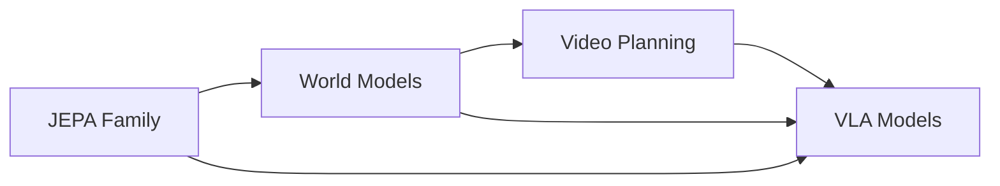

# Physical Intelligence Vault — Map of Content

A research knowledge base covering papers on physical intelligence: world models, joint-embedding architectures, vision-language-action models, and video generation for planning.

---

## JEPA Family
Models based on Joint-Embedding Predictive Architectures for video/image understanding and robot control.

| Paper | Year | Key Idea |
|-------|------|----------|
| [[I-JEPA]] | 2023 | Image JEPA — the original that started it all |
| [[V-JEPA]] | 2024 | Video feature prediction with masking |
| [[V-JEPA 2]] | 2025 | Scaled V-JEPA for understanding + planning |
| [[V-JEPA 2.1]] | 2026 | Dense features for video SSL |
| [[ACT-JEPA]] | 2025 | Joint-embedding for efficient policy representation |
| [[TD-JEPA]] | 2025 | Temporal difference learning + JEPA for zero-shot RL |
| [[Le-JEPA]] | 2025 | Provable, scalable SSL without heuristics |
| [[Le-World-Model]] | 2026 | Stable end-to-end JEPA world model from pixels |

---

## World Models
Models that learn environment dynamics for planning, imagination, and control.

| Paper | Year | Key Idea |
|-------|------|----------|
| [[DreamerV1]] | 2020 | Latent imagination for behavior learning |
| [[DreamerV2]] | 2021 | Discrete world models for Atari |
| [[DreamerV3]] | 2023 | Single algorithm across diverse domains |
| [[IRIS]] | 2023 | Transformer world model with discrete tokens |
| [[DIAMOND]] | 2024 | Diffusion-based world model for visual detail |
| [[Genie 2]] | 2024 | Generative interactive 3D environments |
| [[Hunyuan World 1.5]] | 2025 | Interactive world model with 3D consistency |
| [[Hierarchical Puppeteer]] | 2025 | Hierarchical visual humanoid control |
| [[PLDM]] | 2025 | Planning with latent dynamics from reward-free data |
| [[PEVA]] | 2025 | Whole-body conditioned egocentric video prediction |
| [[Stable World Model]] | 2026 | Reproducible world modeling research framework |
| [[Dream Dojo]] | 2026 | Generalist robot world model from human video |

---

## VLA Models
Vision-Language-Action models for generalist robot control.

| Paper | Year | Key Idea |
|-------|------|----------|
| [[RT-2]] | 2023 | Pioneering VLA transferring web knowledge to robots |
| [[Octo]] | 2024 | Open-source generalist robot policy |
| [[OpenVLA]] | 2024 | Open-source 7B VLA outperforming RT-2-X 55B |
| [[Pi0]] | 2024 | Flow matching foundation model for dexterous tasks |
| [[Pi0.5]] | 2025 | Co-training across heterogeneous robot data |
| [[Pi0.6]] | 2025 | RL from experience with advantage conditioning |
| [[LeVERB]] | 2025 | Humanoid control with latent vision-language instruction |
| [[GR00T]] | 2025 | Dual-system VLA for humanoid robots |
| [[Gemini Robotics]] | 2025 | Gemini 2.0 for embodied reasoning + action |

---

## Video Generation / Planning
Action-conditioned video generation and video-based planning for physical AI.

| Paper | Year | Key Idea |
|-------|------|----------|
| [[UniPi]] | 2023 | Video generation as universal planning |
| [[UniSim]] | 2023 | Universal simulator for action-conditioned video |
| [[NVIDIA Cosmos]] | 2025 | World foundation model platform for physical AI |
| [[Learning Latent Action World Models In The Wild]] | 2026 | Latent action discovery from internet video |

---

## Robotics
Reward design, sim-to-real, and dexterous manipulation.

| Paper | Year | Key Idea |
|-------|------|----------|
| [[Eureka]] | 2023 | LLM-powered reward design for dexterous tasks |

---

## Metrics
See [[Metrics Index]] for all evaluation metrics used across papers.

**Key metric categories:**
- **Classification**: [[Top-1 Accuracy]], [[Mean Average Precision (mAP)]], [[F1 Score]]
- **Generation Quality**: [[PSNR]], [[SSIM]], [[LPIPS]], [[FVD]], [[rFVD]]
- **Robotics**: [[Success Rate]], [[Task Progress Score]], [[Failure Rate]], [[Language Following Rate]]
- **RL**: [[Episode Return]], [[Gamer Normalized Median]], [[Human Normalized Mean]]
- **Representation**: [[Linear Probe Accuracy]], [[Attentive Probe Accuracy]], [[k-NN Accuracy]]
- **Human Evaluation**: [[Human Preference Rate]], [[Motion Naturalness]]

---

## Datasets
See [[Datasets Index]] for all datasets referenced across papers.

**Key dataset categories:**
- **Video**: [[Kinetics-400]], [[Something-Something v2]], [[HowTo100M]], [[Ego4D]]
- **Image**: [[ImageNet-1K]], [[MS-COCO 2017]], [[ADE20K]]
- **Robotics**: [[Open X-Embodiment]], [[DROID]], [[BridgeData V2]], [[Push-T]]
- **RL Environments**: [[DeepMind Control Suite]], [[Atari 2600 Games]], [[Crafter]]
- **Egocentric**: [[EPIC-KITCHENS-100]], [[Ego-Exo4D]], [[Assembly-101]]

---

## Research Themes

**Cross-cutting connections:**
- V-JEPA 2 → Le-World-Model → TD-JEPA (JEPA for control)
- DreamerV3 → Dream Dojo → Hierarchical Puppeteer (world model evolution)
- Pi0 → Pi0.5 → Pi0.6 (Physical Intelligence progression)
- NVIDIA Cosmos → GR00T (NVIDIA's physical AI stack)
- Gemini Robotics builds on PaLM-E / RT-2 lineage
