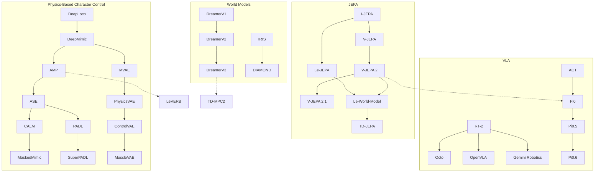

# Physical Intelligence Vault — Map of Content

A research knowledge base covering papers on physical intelligence: world models, joint-embedding architectures, vision-language-action models, physics-based character control, and video generation for planning.

---

## JEPA Family
Joint-Embedding Predictive Architectures for video/image understanding and robot control.

| Paper | Year | Key Idea |
|-------|------|----------|
| [[V-JEPA 2.1]] | 2026 | Dense features for video SSL |
| [[Le-World-Model]] | 2026 | Stable end-to-end JEPA world model from pixels |
| [[V-JEPA 2]] | 2025 | Scaled V-JEPA for understanding + planning |
| [[ACT-JEPA]] | 2025 | Joint-embedding for efficient policy representation |
| [[TD-JEPA]] | 2025 | Temporal difference learning + JEPA for zero-shot RL |
| [[Le-JEPA]] | 2025 | Provable, scalable SSL without heuristics |
| [[V-JEPA]] | 2024 | Video feature prediction with masking |
| [[I-JEPA]] | 2023 | Image JEPA — the original that started it all |

---

## World Models
Models that learn environment dynamics for planning, imagination, and control in simulated environments.

| Paper | Year | Key Idea |
|-------|------|----------|
| [[Stable World Model]] | 2026 | Reproducible world modeling research framework |
| [[Dream Dojo]] | 2026 | Generalist robot world model from human video |
| [[Hunyuan World 1.5]] | 2025 | Interactive world model with 3D consistency |
| [[PLDM]] | 2025 | Planning with latent dynamics from reward-free data |
| [[TD-MPC2]] | 2024 | Scalable world models for continuous control |
| [[DIAMOND]] | 2024 | Diffusion-based world model for visual detail |
| [[Genie 2]] | 2024 | Generative interactive 3D environments |
| [[DreamerV3]] | 2023 | Single algorithm across diverse domains |
| [[IRIS]] | 2023 | Transformer world model with discrete tokens |
| [[DreamerV2]] | 2021 | Discrete world models for Atari |
| [[DreamerV1]] | 2020 | Latent imagination for behavior learning |

---

## Physics-Based Character Control
Learning motor skills for simulated humanoids and characters via RL and motion imitation. Two main lineages: **VAE** (learn a latent action space) and **Adversarial** (learn a motion discriminator).

### Adversarial Lineage (Peng et al.)
| Paper | Year | Key Idea |
|-------|------|----------|
| [[CLoSD]] | 2025 | Closing the loop between simulation and diffusion |
| [[PARC]] | 2025 | Physics-based augmentation with RL for controllers |
| [[SuperPADL]] | 2024 | Scaling language-directed physics-based control |
| [[MaskedMimic]] | 2024 | Unified control via masked motion inpainting |
| [[Vid2Player3D]] | 2023 | Tennis skills from broadcast video (SIGGRAPH Best Paper HM) |
| [[CALM]] | 2023 | Conditional adversarial latent models for directable characters |
| [[ASE]] | 2022 | Adversarial skill embeddings at scale |
| [[PADL]] | 2022 | Language-directed physics-based character control |
| [[AMP]] | 2021 | Adversarial motion priors (key bridge paper) |
| [[MCP]] | 2019 | Multiplicative compositional policies |
| [[SFV]] | 2018 | RL of physical skills from monocular video |
| [[DeepMimic]] | 2018 | Example-guided RL for physics-based character skills |
| [[DeepLoco]] | 2017 | Hierarchical DRL for terrain locomotion |

### VAE Lineage
| Paper | Year | Key Idea |
|-------|------|----------|
| [[MuscleVAE]] | 2023 | Muscle-actuated character control with fatigue dynamics |
| [[PhysicsVAE]] | 2022 | Conditional VAEs for physics-based character control |
| [[ControlVAE]] | 2022 | Model-based generative controllers via learned world model |
| [[MVAE]] | 2020 | Motion VAE for character control in latent space |

### Humanoid Whole-Body Control
| Paper | Year | Key Idea |
|-------|------|----------|
| [[LeVERB]] | 2025 | Humanoid control with latent vision-language instruction |
| [[Hierarchical Puppeteer]] | 2025 | Hierarchical visual whole-body humanoid control |

---

## VLA Models
Vision-Language-Action models for generalist robot control via imitation learning.

| Paper | Year | Key Idea |
|-------|------|----------|
| [[Pi0.5]] | 2025 | Co-training across heterogeneous robot data |
| [[Pi0.6]] | 2025 | RL from experience with advantage conditioning |
| [[GR00T]] | 2025 | Dual-system VLA for humanoid robots |
| [[Gemini Robotics]] | 2025 | Gemini 2.0 for embodied reasoning + action |
| [[Pi0]] | 2024 | Flow matching foundation model for dexterous tasks |
| [[Octo]] | 2024 | Open-source generalist robot policy |
| [[OpenVLA]] | 2024 | Open-source 7B VLA outperforming RT-2-X 55B |
| [[ACT]] | 2023 | Action chunking with transformers for bimanual manipulation |
| [[RT-2]] | 2023 | Pioneering VLA transferring web knowledge to robots |

---

## Video Generation / Planning
Action-conditioned video generation and video-based planning for physical AI.

| Paper | Year | Key Idea |
|-------|------|----------|
| [[Learning Latent Action World Models In The Wild]] | 2026 | Latent action discovery from internet video |
| [[NVIDIA Cosmos]] | 2025 | World foundation model platform for physical AI |
| [[PEVA]] | 2025 | Whole-body conditioned egocentric video prediction |
| [[UniPi]] | 2023 | Video generation as universal planning |
| [[UniSim]] | 2023 | Universal simulator for action-conditioned video |

---

## Sim-to-Real & Reward Design
Transferring policies from simulation to real robots.

| Paper | Year | Key Idea |
|-------|------|----------|
| [[Eureka]] | 2023 | LLM-powered reward design for dexterous tasks |
| [[Learning Agile Robotic Locomotion]] | 2020 | Sim-to-real quadruped by imitating animals (RSS Best Paper) |
| [[Sim-to-Real Transfer]] | 2018 | Dynamics randomization for sim-to-real |

---

## Metrics
See [[Metrics Index]] for all evaluation metrics used across papers.

**Key metric categories:**
- **Classification**: [[Top-1 Accuracy]], [[Mean Average Precision (mAP)]], [[F1 Score]]
- **Generation Quality**: [[PSNR]], [[SSIM]], [[LPIPS]], [[FVD]], [[rFVD]]
- **Robotics**: [[Success Rate]], [[Task Progress Score]], [[Failure Rate]], [[Language Following Rate]]
- **RL**: [[Episode Return]], [[Gamer Normalized Median]], [[Human Normalized Mean]]
- **Representation**: [[Linear Probe Accuracy]], [[Attentive Probe Accuracy]], [[k-NN Accuracy]]
- **Human Evaluation**: [[Human Preference Rate]], [[Motion Naturalness]]

---

## Datasets
See [[Datasets Index]] for all datasets referenced across papers.

**Key dataset categories:**
- **Video**: [[Kinetics-400]], [[Something-Something v2]], [[HowTo100M]], [[Ego4D]]
- **Image**: [[ImageNet-1K]], [[MS-COCO 2017]], [[ADE20K]]
- **Robotics**: [[Open X-Embodiment]], [[DROID]], [[BridgeData V2]], [[Push-T]]
- **RL Environments**: [[DeepMind Control Suite]], [[Atari 2600 Games]], [[Crafter]]
- **Motion Capture**: [[CMU Motion Capture Database]]
- **Egocentric**: [[EPIC-KITCHENS-100]], [[Ego-Exo4D]], [[Assembly-101]]

---

## Research Lineages

